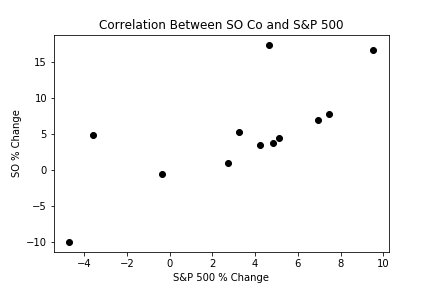
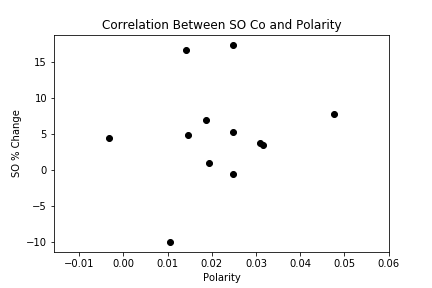
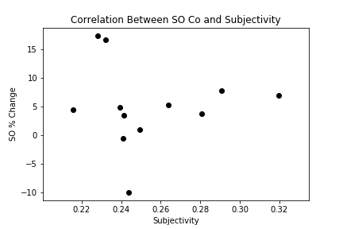

# Q. Quarterly Inc.
**Foreseeing Future Returns, With Just A Timeframe & Company Name**

   

**The Project:**  We have now reached the end of the program! To "showcase" the skills we have obtained during our time here at the Flatiron Data Science Bootcamp, we have put together "a professional-level data science project" using our own choice of data. 

**The Goal:**  The goal was to use the 10-Q reports of a company to conduct a sentiment analysis. Based off of the language of the documents one would be able to check for patterns that would show a relationship between a change in stock price & the document itself.

**The Problem:**  The stock market is a scary place for some people, and can be overwhelming at times. With the long hours of research, economic surprises (aka corona virus), & charts overload, where does one begin.     

**The Solution:**  Here at Q Quarterly Inc. we have developed a fundamental analysis department and technical analysis deparment to do the work for you. All you have to do is give us a company name and time frame. 

**The Data:**  The data came from a list of NYSE Companies that were registered with the SEC. More details on the data can be found in the Data Gathering & Cleaning notebook, located in the Repository Guide.

**The Process**

1. Gather The Data

2. Clean & Preprocess The Data

3. Explore The Data

4. Sentiment Analysis

# Conclusion
The wording of the 10-Q reports did have some correlation with the price change of Southern Co, but not as much as the market price change. See Sentiment Analysis Notebook for more details.
# The Market vs. Price Change
 

# 10Q Polarity vs. Price Change
 

# 10Q Subjectivity vs. Price Change
 

# Future Recommendations
In the future I would like to take in more companies for sentiment analysis. I would also like to select a couple of fundamental analysis techniques to focus my search for more text data; 10-k documents, accredited news articles, etc.. The more text data I have from specific sources the better chance I have at finding a pattern. The outliers in the data would be a point of focus in the future, as well as tokenizing the data to see if sentences or words improve the sentiment analysis values vs the body of text. Lastly I would look into parsing the numbers of the documnet to further improve the sentiment analysis.   

# Repository Guide

Data Gathering & Cleaning: https://github.com/bmor2552/QQuarterlyInc/blob/master/Notebooks/Step1_Data_Upload_%26_Cleaning.ipynb

Sentiment Analysis Notebook: https://github.com/bmor2552/QQuarterlyInc/blob/master/Notebooks/Step2_Sentiment_Analysis.ipynb

Presentation: https://www.canva.com/design/DAD8RPLUoGI/rlRi1Y4f33A11-CUDTFOBg/view

# Professional Contact & Blog 

LinkedIn: https://www.linkedin.com/in/boi-n-moriba-8510351a3/

Github Home Page: https://github.com/bmor2552

Dev.to: https://dev.to/bmor2552
